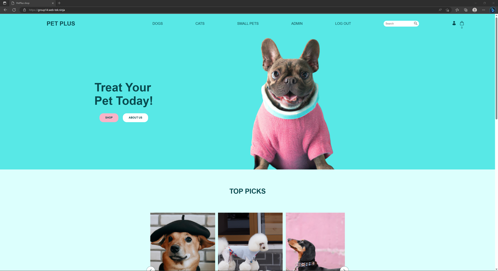
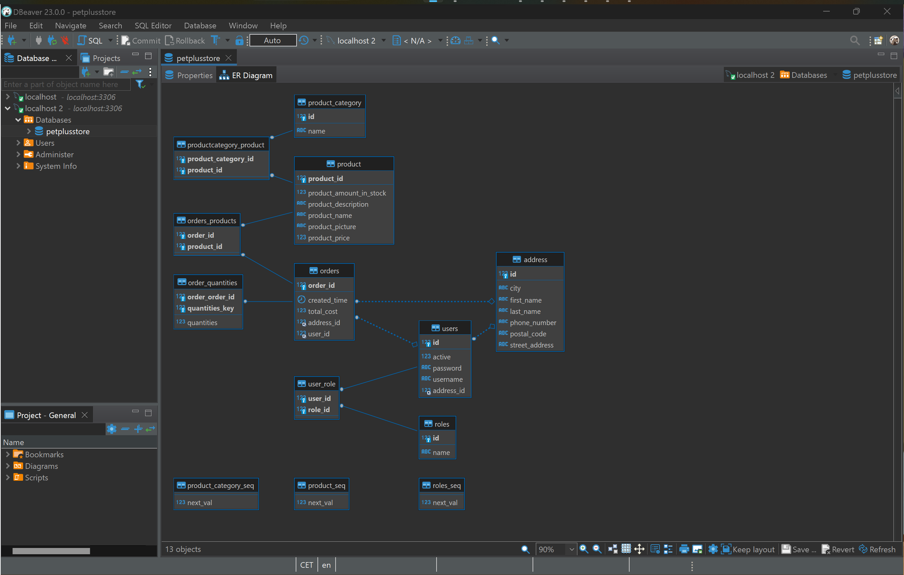

# PetPlusProject

This project is a part of the IDATA2301 and IDATA2306 courses at NTNU, for this project we have to make a Frontend and Backend for a fictional web store called Pet Plus.

# What is Pet Plus?
Pet Plus is the premier online store for pet fashion and accessories. Our mission is to 
provide pet owners with the highest quality pet clothing and accessories to keep their furry friends 
looking and feeling their best. We believe that pets should be stylish and comfortable, and our products 
reflect that. Our selection includes a wide range of pet clothing and accessories, such as coats, sweaters, 
bandanas, and more.

# Prerequisites:
MySQL database

# Environment Variables:
The project requires the following environment variables to be set:

PET_PLUS_DB_USER: The username for the MySQL database.

PET_PLUS_DB_PASS: The password for the MySQL database.

# Database Setup

CREATE DATABASE petplusstore;

The project will make the tables and data when run. 

# Getting Started

Clone the repository:   git clone [repository URL]

Navigate to the project directory:   cd [project directory]

Run the project using Maven:   mvn spring-boot:run

The project will be running on default port. Open a web browser and access the application:  http://localhost:[port]

# Notes
The project can also be accessed at: http://group14.web-tek.ninja/ while on NTNUs network.
